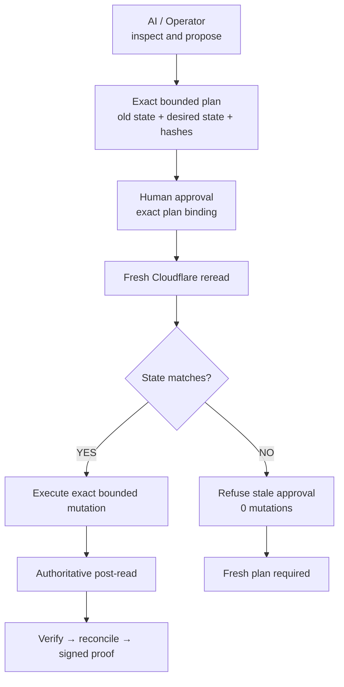

# dave/cloudflare-traffic-governance

`dave/cloudflare-traffic-governance` is a RailCall-native module for bounded,
governed Cloudflare DNS traffic changes. It reads authoritative state, creates
an exact old-to-new plan, binds the intended state before approval, refuses
stale plans, executes only bounded mutations, rereads Cloudflare, reconciles
the result, and preserves signed evidence through native RailCall receipts.

The module is designed for consequential production work: the operator or AI
may inspect and propose, but a human must authorize the exact action.

## At a glance

| | |
|---|---|
| **Problem** | Blind DNS mutation can overwrite provider state that changed after approval. |
| **Difference** | Exact state binding, fresh Cloudflare reread, fail-closed batch gates, and proof after the provider effect. |
| **Provider** | Cloudflare DNS through `api.cloudflare.com`. |
| **Surface** | 20 commands: 15 read/analysis/proof paths and 5 governed mutation/recovery paths. |
| **Module** | `dave/cloudflare-traffic-governance` `0.1.0`. |
| **Runtime integration** | `dave-cloudflare-traffic-governance::cloudflare`. |
| **Current evidence** | Live bounded Cloudflare E2E for the three disposable test names; governance limitations remain explicit. |

> **Approval is not permission to overwrite reality.**

### Documentation map

- [Testing and evidence](TESTING.md) — evidence levels, acceptance matrix, live scope, and limitations.
- [Command reference](COMMANDS.md) — all 20 manifest contracts, inputs, outputs, and failure semantics.
- [Locked video guide](VIDEO_GUIDE_STEP3.md) — pending production specification; no video is claimed here.

## What it does

- Reads Cloudflare account readiness, zones, and exact DNS records.
- Inspects a bounded target set and computes deterministic state fingerprints.
- Builds an exact change plan with old state, proposed state, ordered actions,
  plan hash, expected state hash, and action hash.
- Assesses risk and creates an approval-ready preview.
- Performs a fresh authoritative provider reread before every mutation.
- Refuses stale state and stale batch members before the first write.
- Supports governed single-record create, update, delete, and bounded batch
  changes through the Cloudflare DNS allowlist.
- Verifies expected post-state from Cloudflare rather than treating HTTP 2xx as
  proof.
- Reconciles planned, approved, executed, actual, approval, and receipt
  evidence.
- Plans rollback as a new governed action; rollback is never a silent undo.
- Exposes proof data while leaving native receipt, identity, quorum, and
  cryptographic authority with RailCall Station.

## Why this exists

DNS automation is easy. Blind production mutation is dangerous.

An approval can become unsafe if the provider state changes after approval. A
record may be edited by another operator, a TTL or proxy flag may drift, or one
member of a batch may no longer match. This module binds approval to the
specific state and payload, rereads the provider immediately before writing,
and fails closed when reality no longer matches the approved plan.

The governing principle is simple:

> Approval is not permission to overwrite reality.

## Core workflow

```text
Inspect
  → Plan
  → Risk
  → Preview
  → Human approval
  → Fresh precondition
  → Execute
  → Authoritative verify
  → Reconcile
  → Prove
```

The hostile branch is:

```text
State changed after approval
  → fresh reread detects drift
  → stale approval refused
  → no write
  → fresh plan required
```

### Governance boundary at a glance



The diagram is the trust boundary, not a claim that every branch has the same
live evidence level. See [Testing and evidence](TESTING.md) for the distinction.

## Key capabilities

### Implemented and bounded

- Live Cloudflare zone and DNS reads.
- Exact create, update, and delete plans.
- Bounded batch changes with an explicit target list.
- Canonical state pinning across material DNS fields, including `proxied` and
  `ttl`.
- Stale-state detection and fail-closed batch preconditions.
- Deterministic plan, state, and action hashes.
- Idempotency references and replay-safe handling at the module boundary.
- Authoritative post-read verification.
- Reconciliation that refuses to report green when evidence disagrees.
- New governed rollback planning and execution.
- Signed native RailCall receipts and evidence references where Station provides
  them.

### Not claimed as current Cloudflare runtime proof

The Step 2 audit did not establish distinct native Cloudflare Team-approver
runtime coverage for GV2–GV7, native write-approval expiry, or genuine
out-of-band Cloudflare drift. The module exposes the data and gates needed for
those paths, but this project does not claim those cases as live-proven.

## Supported scope

The current provider scope is Cloudflare DNS through the allowlisted host
`api.cloudflare.com`. The module does not accept a caller-selected HTTP method,
path, body, or arbitrary provider endpoint.

Explicit exclusions:

- arbitrary Cloudflare REST proxying;
- arbitrary endpoint, method, or JSON passthrough;
- shell or code execution;
- zone deletion or account modification;
- unbounded bulk mutation or “every DNS record” targeting;
- silent automatic rollback;
- AI self-approval or AI quorum participation;
- mutation of an already-approved payload;
- Cloudflare Load Balancing as a core dependency.

## Architecture and trust boundary

| Actor | Responsibility |
|---|---|
| AI/operator | Discover, inspect, explain, assess, plan, propose, and request execution. |
| Human | Authorize the exact plan and payload through the native RailCall approval boundary. |
| RailCall Station | Resolve the credential, bind plan/state/action hashes, enforce gates, manage native approval/receipt boundaries, dispatch the exact handler, and preserve provenance. |
| This module | Call only the Cloudflare DNS allowlist, canonicalize state, enforce bounded targets, detect drift, verify provider post-state, reconcile evidence, and expose proof data. |
| Cloudflare | Authoritative external DNS state and provider response. |

AI cannot approve, count itself as quorum, lower risk, weaken policy, alter an
approved payload, bypass stale checks, call arbitrary endpoints, silently
rollback, or claim success without evidence.

## Governance model

- Approval is bound to the exact plan hash, expected state hash, action hash,
  targets, and material old/new fields.
- No provider mutation is allowed before the approval boundary and fresh
  precondition check.
- The precondition check rereads every target immediately before mutation.
- Any material drift produces `STALE_STATE` for a single action or
  `BATCH_PRECONDITION_FAILED` for a batch, with zero batch mutations executed.
- Rollback creates a new plan from current authoritative state to the saved
  prior state; the original approval is not reused.
- A provider 2xx response is execution evidence, not verification.
- A successful effect must be reread, compared with expected post-state, and
  reconciled before it is described as verified.

The module does not claim that the Cloudflare path has live native Team
multi-approver proof. Native RailCall Team primitives are a platform boundary,
not a Step 2 Cloudflare runtime result.

## Risk model

| Risk | Actual command families | Meaning |
|---|---|---|
| LOW | `account_preflight`, `zone_list`, `zone_get`, `dns_record_list`, `dns_record_get`, `traffic_state_inspect`, `change_plan` | Discovery, inspection, or local planning; no external mutation. |
| MEDIUM | `dns_conflict_check`, `change_risk_assess`, `change_preview`, `precondition_check`, `change_verify`, `change_reconcile`, `change_prove` | Analysis, approval preparation, gate, verification, reconciliation, or proof; no external mutation. |
| HIGH | `dns_record_create`, `dns_record_update`, `dns_batch_change`, `rollback_plan` | Consequential bounded work or rollback preparation; native approval policy applies to writes. |
| CRITICAL | `dns_record_delete`, `rollback_execute` | Destructive or recovery mutation; requires fresh governed authority. |

Risk assessment is advisory data. The module blocks a batch above its hard
limit and does not allow AI to lower a policy decision.

## Setup

### 1. Cloudflare prerequisites

Create or use a Cloudflare zone that the operator is authorized to manage. For
the documented test evidence, the zone was `davelabs.my.id`.

Create a scoped Cloudflare API Token, not a Global API Key, with only:

- Zone Read;
- DNS Read;
- DNS Write;
- scope limited to the intended zone.

Never place the token in this repository, a command example, a receipt, or a
module output.

### 2. Native RailCall credential setup

Use RailCall Studio Integrations to store the token in the native vault under
the Cloudflare provider credential. The handler requests the logical
credential slot `cloudflare`; Station resolves it using this canonical runtime
integration identifier:

```text
dave-cloudflare-traffic-governance::cloudflare
```

This is deliberately different from the marketplace module ID:

```text
marketplace module ID: dave/cloudflare-traffic-governance
runtime integration ID: dave-cloudflare-traffic-governance::cloudflare
```

Do not rename the marketplace module to fix credential resolution. The slash
form is the public module identity; the hyphenated form is the Station
normalized integration identity.

### 3. Local developer install

From the project root, after reviewing the module source:

```bash
railcall market module sign ./module
railcall market module verify ./module
railcall market install --from-path ./module
```

The signed local bundle must be verified before install. The Step 2 audit
recorded a v2 tree signature, matching source/installed hashes, and 20 loaded
commands.

### 4. Safe read-only validation

Use native RailCall dispatch after the credential is configured. Start with:

```text
cloudflare.traffic.account_preflight
cloudflare.traffic.zone_list
cloudflare.traffic.zone_get
cloudflare.traffic.dns_record_list
```

The last command requires the exact `zone_id` returned by `zone_list`. Use
`dns_record_get` only when an existing record ID is available. A read-only
preflight does not verify write permission; write capability must be exercised
only through an explicitly approved governed mutation.

## Quick start

The minimal safe path is:

1. Run `account_preflight` with no raw credential input.
2. Run `zone_list` and select one exact zone.
3. Run `zone_get` and `dns_record_list` for that zone.
4. Run `traffic_state_inspect`, `change_plan`, `change_risk_assess`, and
   `change_preview` for an explicit bounded target set.
5. Obtain the required human approval through native RailCall.
6. Run the fresh precondition gate.
7. Execute only the exact approved command, then verify and reconcile.

The complete input/output contracts are in [COMMANDS.md](COMMANDS.md).

## Example governed cutover

The following is a documentation/test example, not a production
recommendation. It is limited to the three disposable names used by the Step 2
E2E evidence:

```text
railcall-e2e-a.davelabs.my.id  192.0.2.10 → 198.51.100.44
railcall-e2e-b.davelabs.my.id  192.0.2.10 → 198.51.100.44
railcall-e2e-c.davelabs.my.id  192.0.2.10 → 198.51.100.44
```

`192.0.2.10`, `198.51.100.44`, and `203.0.113.77` are documentation/test
addresses. They are not production routing guidance.

Normal path:

```text
read A/B/C
→ create exact plan and hashes
→ assess risk and preview
→ human approval
→ reread all three
→ execute bounded batch
→ reread all three
→ verify and reconcile
```

If one record changes after approval, the fresh reread returns a stale batch
precondition result and executes `0/3` mutations. The correct next action is a
fresh inspection and plan, not an automatic retry or rollback.

## Verification and proof

The strongest evidence chain is:

```text
exact plan
→ exact approval binding
→ fresh authoritative precondition
→ provider result
→ authoritative post-read
→ verification
→ reconciliation
→ signed RailCall receipt
→ offline receipt verification
```

Important states include `EXECUTED_AND_VERIFIED`,
`CONFIRMED_BY_RECONCILIATION`, `NOT_RECONCILED`,
`EFFECT_LANDED_EVIDENCE_INCOMPLETE`, and `UNKNOWN`. A non-green state is
reported honestly; it is never converted to success because a provider returned
2xx.

## Failure semantics

The implementation and audit use these important states or failure classes:

- `HUMAN_APPROVAL_REQUIRED`: authority was not supplied for a write.
- `AWAITING_APPROVAL`: preview is ready but has not been approved.
- `AWAITING_TEAM_APPROVAL`: platform governance requires additional approval;
  current Cloudflare Team runtime was not proven in Step 2.
- `STALE_STATE`: a fresh single-target precondition does not match.
- `BATCH_PRECONDITION_FAILED`: at least one batch target drifted; zero batch
  writes are executed.
- `POLICY_BLOCKED`: a policy or hard batch cap refuses the operation.
- `NOT_LANDED`: provider mutation did not happen after a precondition refusal.
- `UNKNOWN`: transport or provider ambiguity cannot safely establish effect.
- `EXECUTED_NOT_RECONCILED`: execution occurred but evidence is incomplete.
- `EFFECT_LANDED_EVIDENCE_INCOMPLETE`: provider accepted the write but the
  authoritative post-read failed.
- `UNSUPPORTED_ACTION`: unsupported operation, record type, or provider path.
- `UNBOUNDED_TARGET_SET`: targets are absent, duplicate, or not explicitly
  bounded.
- `NOT_RECONCILED`: observed state or evidence disagrees with the expected
  chain.

## Limitations

- Current scope is Cloudflare DNS only.
- There is no arbitrary Cloudflare API proxy or caller-selected endpoint.
- Team multi-approver Cloudflare runtime scenarios GV2–GV7 were not live
  verified in the Step 2 environment.
- Native module write-approval expiry was not verified; the optional preview
  `approval_expiry` field is not evidence of native enforcement.
- Genuine external out-of-band drift was not live introduced in Step 2; stale
  gates are mock/runtime-tested and the native precondition logic is bounded.
- Provider-side atomicity is not claimed. The batch guarantee is all-target
  precondition before first mutation plus authoritative post-read.
- A timeout or provider ambiguity is not blindly retried; it requires a read,
  verify, or reconciliation decision.
- Rollback is a new governed action and is not silent.
- Batches are capped at 25 targets by the handler; reads are capped at 100
  records per page and targets at 50 for bounded inspection.
- The exact native credential slot is `cloudflare`, resolved through
  `dave-cloudflare-traffic-governance::cloudflare`.
- `rollback_execute` currently delegates to the bounded batch handler, so its
  inner handler response may label `command` as
  `cloudflare.traffic.dns_batch_change`; native Station invocation and receipt
  identity remain the outer authority.
- Cloudflare Load Balancing is not a core dependency.

## Security and secrets

- Store the scoped API token in the native RailCall vault/integration.
- Use least-privilege Zone Read, DNS Read, and DNS Write permissions scoped to
  the intended zone.
- The handler reads the logical `cloudflare` credential slot; it does not print
  the token and sanitizes provider error details.
- Raw credentials, auth headers, browser/session material, and private keys do
  not belong in module outputs, receipts, tests, or documentation.
- The Step 2 audit confirmed secret-free credential lookup output and did not
  expose the token value.

## Testing

See [TESTING.md](TESTING.md) for the evidence matrix and verification levels.
The current documented result is **19 passed, 0 failed** for the project
regression suite.

The evidence split is:

| Level | Documented result |
|---|---|
| **LIVE PROVIDER** | Cloudflare auth/read, create, update, delete, bounded 3/3 batch, authoritative verification, rollback, cleanup, consumed-approval replay boundary, and the final cleanup receipt's offline signature verification. |
| **AUTOMATED / RUNTIME** | Stale-state refusal, batch stale `0/N`, TTL/proxied material-field drift, timeout ambiguity, verification mismatch, reconciliation mismatch, command registration, and normalized credential lookup. |
| **NOT LIVE VERIFIED** | Genuine external actor drift S1/S2/S3/H12, Cloudflare Team GV2–GV7, native approval expiry, and receipt tamper H10. |

This distinction is intentional: the strongest live E2E is real and bounded,
while hostile external-actor and native Team cases remain openly limited.

## Command reference

See [COMMANDS.md](COMMANDS.md) for all 20 frozen commands, exact manifest
inputs, authority/risk classes, provider effects, failure modes, and sanitized
response shapes.

## Video

The locked production specification is [VIDEO_GUIDE_STEP3.md](VIDEO_GUIDE_STEP3.md).
Step 3 video production and Step 5 YouTube publication remain pending. No
YouTube URL is claimed here.

## Metadata

- Marketplace module ID: `dave/cloudflare-traffic-governance`
- Name: `cloudflare-traffic-governance`
- Version: `0.1.0`
- Provider: Cloudflare
- Category: Infrastructure
- License required by manifest: `false`
- Allowed destination: `api.cloudflare.com`
- Subprocess capability: disabled
- Filesystem writes: none declared

The repository and manifest do not declare a license name or author field; no
license or author claim is added here.
